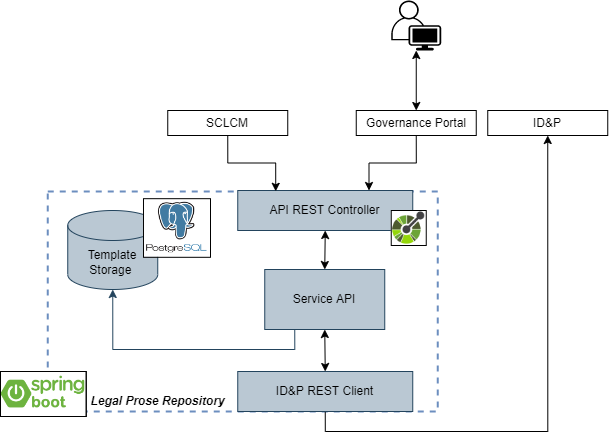

# Legal Prose Repository

## Introduction
The main scope of the Legal Prose Repository (LPR) is to provide a storage service for
the legal templates used in 5GZORRO Platform as baseline for the creation of legal
documents such as Service Level Agreements and Licenses

The project encapsulates the Legal Prose Repository module of the 5GZORRO platform. 
It is a SpringBoot application with associated documentation built from Swagger annotations.



## Prerequisites

### System Requirements
- 1 vCPU
- 2GB RAM

### Software dependencies
- PostgreSQL </br>
  ```bash
  docker run --name some-postgres -p 5432:5432 -e POSTGRES_PASSWORD=postgres -d postgres
  ```

If you want to deploy LPR in a not-virtualized environment you'll need also:

- Java 11 </br>
  ```bash
  sudo apt update
  sudo apt install openjdk-11-jdk
  ```
- Maven </br>
  ```bash
    sudo apt update
    sudo apt install maven
    ```

### 5GZORRO Module dependencies
- [Identity and Permission Manager](https://github.com/5GZORRO/identity)

## Installation
The following procedures consider the previously listed dependencies already up and running.
Both the installation procedures reported below require the creation of the required database in the running
postgres instance. Run the following commands in order to create them:
```bash
docker exec -it <postgres_docker_id> /bin/bash
su postgres
createdb operator_x_legal_prose;
```

### Local Machine
Run
```bash
export spring_profiles_active=staging
./mvnw spring-boot:run
```

### Helm
The following instructions consider the previously listed dependencies already up and running.
```bash
helm install legal-prose-api ./helm/charts/legal-prose-repository/   
  --namespace operatorx-ns           
  --values ./helm/charts/legal-prose-repository/values.yaml           
  --set dockerTag=5gzorro-core-1.7-rc           
  --set postgres.username=postgres           
  --set postgres.password=postgres           
  --set postgres.name=operator_x_legal_prose           
  --set identityBaseUrl="http://172.28.3.153:6200"   
  --set identityDID=<stakeholder_did>        
  --set callbacks.updateTemplateIdentity="http://172.28.3.6:31084/legal-prose-repository/api/v1/legal-prose-templates/%s/identity"
```

## Configuration
No particular configurations are needed.

## Maintainers
**Pietro Giuseppe Giardina** - *Design* - p.giardina@nextworks.it </br>
**Michael De Angelis** - *Develop and Design* - m.deangelis@nextworks.it </br>

## License
This module is distributed under [Apache 2.0 License](LICENSE) terms.